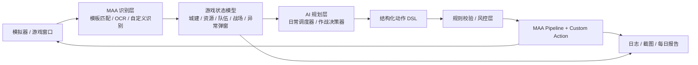

# 基于 MaaFramework 的三战助手路线规划

> 说明
>
> - 这里默认“`三战`”指《三国志·战略版》。
> - 最终目标不是做一堆零散脚本，而是做一个“AI 负责规划，MAA 负责稳定执行，你每天只负责看结果和收菜”的可演进系统。
> - 以 2026-03-27 查阅的 MaaFramework 官方文档为基准，当前最适合的路线是 `JSON + 自定义逻辑扩展`，并补齐 `interface.json` 接入通用 UI。

## 1. 最终目标

从结果倒推，这个项目的北极星应该是下面这套能力：

- 日常全自动：登录、领取、任务、活动、资源处理、征兵/练兵/屯田/建筑等固定流程尽量无人值守。
- 作战可自主：AI 能基于当前局势决定执行哪类标准动作，比如铺路、驻守、撤退、补兵、集结、打地、响应指令。
- 风险可控：高风险动作有白名单、冷却、失败回退、人工确认开关，避免“AI 想做什么就直接点什么”。
- 结果可回看：每天自动生成一份执行摘要，告诉你做了什么、哪里失败了、哪些地方需要你接手。

一句话总结：

**先做稳定的“收菜型自动化”，再做可控的“作战型智能体”。**

## 2. 为什么基于 MAA 做

MaaFramework 适合这个方向，核心原因有三点：

- 它天然适合“截图识别 -> 决策 -> 点击执行”的游戏自动化场景。
- 官方当前明确推荐 `JSON + 自定义逻辑扩展`，也就是让稳定流程继续留在可视化/可维护的 pipeline 里，把复杂逻辑放到 Agent 进程里。
- `ProjectInterface`（`interface.json`）已经是官方标准化入口。即使主逻辑用通用语言实现，官方也建议定义 PI，这样可以接入通用 UI、调试工具和后续生态。

这对你的目标特别重要，因为“三战助手”不是纯脚本项目，而是一个分层系统：

- MAA 负责稳定执行
- 自定义识别负责读懂当前游戏状态
- AI 负责高层规划和动作选择
- 风控层负责拦住危险动作

## 3. 不建议一开始就做的事情

为了把项目做成，而不是做成一个巨坑，下面三件事不建议开局就上：

- 不建议一开始就做“视觉大模型端到端直接点屏幕”。
  这样看起来很智能，实际会把稳定性、调试性和成本全部拉满，出了问题也很难定位。
- 不建议一开始就追求“完全无人值守作战”。
  作战态势复杂、界面噪声多、异常状态多，最容易出事故。应该先做建议模式，再做半自动执行。
- 不建议一开始就做很重的桌面前端。
  前期先把资源、pipeline、状态建模和 Agent 跑顺，比做 UI 更值钱。

## 4. 推荐的总体架构

推荐采用“感知、规划、执行、回报”四层结构：



推荐分工如下：

- `MAA Pipeline`
  负责稳定、重复、步骤清晰的任务，比如进城、点按钮、进入子页面、处理普通弹窗。
- `Custom Recognition`
  负责标准 OCR/模板不好做的状态提取，比如地图坐标解析、队伍状态判断、战况摘要提取、复杂 UI 区域判断。
- `Custom Action`
  负责需要动态逻辑的动作，比如根据状态决定下一条链路、执行条件点击、处理异常恢复、批量调度。
- `AI Planner`
  不直接点击屏幕，只输出结构化意图，例如“先征兵再屯田”“对目标坐标发起驻守”“发现伤兵过多则回撤”。
- `Guard/Safety`
  对 AI 输出做白名单校验、前置条件检查、频率限制、回退和人工确认。

## 5. 核心设计原则

### 5.1 AI 不直接操作屏幕

AI 最好不要直接输出坐标点击，而是只输出“意图”：

```json
{
  "intent": "battle.dispatch",
  "team_id": 2,
  "target": { "x": 512, "y": 884 },
  "mode": "garrison",
  "constraints": {
    "require_idle_team": true,
    "max_march_minutes": 8,
    "confirm_if_high_risk": true
  }
}
```

然后由执行层做三件事：

- 校验当前状态是否满足执行条件
- 选择正确的 MAA 任务链
- 执行后验证结果是否真的成功

这样做的好处是：AI 可以聪明，但执行必须可控。

### 5.2 先单环境，再泛化

开局必须锁死一套环境：

- 单模拟器
- 单分辨率
- 单显示缩放
- 单包名/单渠道
- 单语言配置

否则你还没开始写业务，就会先死在适配地狱里。

### 5.3 先状态机，再智能体

三战助手真正难的不是“点哪里”，而是“当前到底在什么状态”。

所以前期最重要的资产不是 prompt，而是：

- 页面图谱
- 状态机
- 异常弹窗清单
- 关键 UI 元素素材库
- 可复用任务节点库

## 6. 分阶段路线

下面这条路线是我认为最稳、也最贴近你最终目标的做法。

| 阶段 | 目标 | 关键产物 | 验收标准 |
| --- | --- | --- | --- |
| Phase 0 | 可行性打底 | 运行环境、模拟器接入、首个 pipeline | 能从桌面进入游戏主界面并执行 1 条简单任务 |
| Phase 1 | 感知与状态建模 | 页面图谱、关键识别点、异常弹窗表 | 能稳定识别“当前在什么页面”和常见异常 |
| Phase 2 | 日常自动化 MVP | 登录、领取、任务、资源处理、常规循环任务 | 一键跑完一套日常，成功率达到可复跑水平 |
| Phase 3 | AI 日常调度 | 状态快照、任务优先级、资源规划 | AI 能按资源/体力/队伍状态动态排日常顺序 |
| Phase 4 | 作战建议模式 | 战场识别、目标选择、动作建议 | 给出建议而不自动执行，输出可读作战方案 |
| Phase 5 | 半自动作战 | 标准作战动作库、白名单执行 | 对低风险战术动作进行自动执行 |
| Phase 6 | 全自动闭环 | 日报、异常告警、失败恢复、长期运行 | 你每天看摘要和接管少量异常即可 |

### Phase 0：环境与脚手架

目标是把最小闭环跑起来，不追求功能多。

建议先做：

- 选定唯一目标环境，例如 `Windows + 指定模拟器 + ADB`。
- 先跑通 MaaFramework 项目模板或等价脚手架。
- 建立 `interface.json`，哪怕先只配置最少信息。
- 做一个最小 pipeline：识别主界面某个稳定按钮并点击。

退出条件：

- 能连接到目标环境
- 能截图
- 能识别一个稳定元素
- 能执行一次点击并拿到日志

### Phase 1：页面图谱与状态机

这一阶段决定后面会不会越做越稳。

建议产出：

- 主城、地图、队伍、任务、活动、邮件、征兵、战斗相关页面的页面图谱
- 每个页面的“进入条件、识别锚点、退出方式、常见异常”
- 弹窗库：更新提示、奖励弹窗、确认框、网络异常、队列已满、体力不足等
- 一套统一状态定义，例如：
  - `HOME_CITY`
  - `WORLD_MAP`
  - `TEAM_PANEL`
  - `BATTLE_REPORT`
  - `UNKNOWN_POPUP`

退出条件：

- 给任意一张当前截图，系统能判断大概率处于哪个状态
- 出现常见弹窗时能走统一兜底逻辑

### Phase 2：日常自动化 MVP

这是最该优先做的部分，因为它最接近“每天来看成果收菜”。

建议优先级：

- 登录与重连
- 奖励领取
- 邮件处理
- 常规任务处理
- 征兵/练兵/资源产出相关操作
- 体力相关固定消耗流程
- 异常中断恢复

这一阶段尽量让流程是“稳定脚本 + 少量动态判断”，不要急着塞很多 AI。

退出条件：

- 一键启动后，能在较少人工干预下完成一轮日常
- 失败时能保存日志、截图和失败节点

### Phase 3：AI 日常调度器

到这里，AI 才真正开始产生价值。

建议 AI 只做高层规划，不做底层点控，例如：

- 根据资源余量决定今天优先征兵还是建筑
- 根据队伍空闲情况决定先做哪类任务
- 根据体力、时间窗、队列状态决定顺序
- 根据失败记录调整下一次执行策略

这里最关键的是“状态快照”：

- 当前资源
- 队伍状态
- 建筑/征兵/练兵队列
- 任务可领取情况
- 当前时间和预设偏好

退出条件：

- 同样的日常任务，AI 可以根据当天状态输出不同顺序
- 输出是结构化计划，不是纯自然语言

### Phase 4：作战建议模式

这是把项目从“收菜助手”升级为“军师助手”的分水岭。

推荐先做建议，不自动执行：

- 读取当前战场状态
- 分析可出动队伍、兵力、距离、目标类型
- 输出标准化建议：
  - 谁去
  - 去哪里
  - 做什么
  - 为什么
  - 风险点是什么

退出条件：

- 能生成一份作战建议
- 建议内容能被你快速判断“值不值得执行”

### Phase 5：半自动作战

只有在建议模式足够靠谱之后，才进入自动执行。

建议先纳入白名单的动作：

- 派指定队伍去指定坐标
- 驻守/回撤
- 低风险补兵
- 固定模板的打地/铺路
- 标准化响应盟友指令

暂时不要默认全自动的动作：

- 高价值目标抢点
- 多队联动的复杂战术
- 代价高、容错低的关键决策

退出条件：

- 低风险作战动作可以稳定执行
- 高风险动作默认进入人工确认或仅建议模式

### Phase 6：日报与长期运行

这一阶段才真正接近你的最终体验。

建议补齐：

- 每日执行摘要
- 作战执行记录
- 失败截图和失败原因分类
- 异常重试与冷却
- 定时运行
- “只做低风险动作”开关
- “作战仅建议不执行”开关

最终理想体验：

- 你每天只需要打开助手看报告
- 收资源、看收益、接管少数异常

## 7. 推荐技术栈

从落地效率看，我建议第一版这样选：

- `MaaFramework`
  作为自动化执行内核
- `Python Agent`
  作为自定义识别、自定义动作和 AI 编排层
- `ADB`
  作为第一优先控制方式
- `OCR + 模板匹配 + 自定义识别`
  作为混合感知方案
- `SQLite`
  作为状态缓存、历史记录和日报数据源
- `LLM API / 本地模型`
  作为规划器，不直接控制屏幕

为什么先推 Python：

- 官方样例和生态相对顺手
- 自定义识别/动作开发快
- 适合先把 Agent、规则和实验性逻辑跑通

等核心逻辑稳定后，再考虑是否补一个桌面端或 Web 面板。

## 8. 推荐目录结构

建议一开始就按“资源”和“代码”分离：

```text
SanzhanAssistant/
├── interface.json
├── docs/
│   └── sanzhan-assistant-roadmap.md
├── resource/
│   ├── image/
│   ├── model/
│   │   └── ocr/
│   └── pipeline/
├── src/
│   ├── agent/
│   ├── recognizers/
│   ├── actions/
│   ├── planner/
│   ├── state/
│   ├── safety/
│   └── report/
├── config/
└── reports/
```

职责建议：

- `resource/pipeline/`
  放 MAA 任务流水线 JSON
- `src/recognizers/`
  放复杂状态识别逻辑
- `src/actions/`
  放动态动作和异常恢复逻辑
- `src/planner/`
  放 AI 日常调度和作战决策
- `src/safety/`
  放白名单、节流、前置校验和回退策略
- `reports/`
  放日报和关键截图

## 9. 关键风险

这类项目真正的难点，不在“能不能点”，而在“能不能长期稳定地点”。

我会重点盯下面这些风险：

- 界面变化风险
  分辨率、缩放、活动 UI、赛季差异都可能让识别失效。
- OCR 噪声风险
  地图坐标、兵力数字、按钮文本可能在复杂背景下不稳定。
- 异常状态爆炸
  游戏里弹窗、卡顿、网络抖动、战斗中断会非常多。
- 作战决策风险
  AI 的建议未必错，但“建议正确”不等于“自动执行安全”。
- 合规与封控风险
  这类项目要默认假设存在使用风险，因此从设计上就要支持降级、限权和人工确认。

## 10. 我对这条路线的判断

如果目标是：

“最终让 AI 自主帮你完成日常和部分作战，你每天只看结果和收菜”

那最合理的路线不是：

“先上 AI，再想办法让它点得准”

而是：

“先把 MAA 变成稳定执行器，再让 AI 成为可控的大脑”

换句话说：

- `MAA` 解决“怎么稳”
- `状态建模` 解决“现在是什么情况”
- `AI Planner` 解决“下一步该做什么”

这三件事缺一不可，但顺序一定要对。

## 11. 我建议你下一步立刻做的事

如果你认可这条路线，下一步最值得马上开工的是：

1. 锁定目标运行环境
   明确模拟器、分辨率、渠道服、语言和控制方式。
2. 初始化 MaaFramework 项目骨架
   先把 `interface.json`、资源目录和最小 pipeline 跑起来。
3. 收集第一批页面样本
   主城、地图、队伍、任务、活动、邮件、征兵，以及常见弹窗。
4. 先完成“日常 MVP”
   不碰 AI 作战，优先做真正能省你时间的固定收益流程。
5. 再设计 AI 的动作 DSL
   让 AI 只输出结构化意图，不直接输出点击操作。

## 12. 参考资料

- MaaFramework 快速开始（官方）：<https://maafw.com/docs/1.1-QuickStarted>
- MaaFramework Project Interface V2（官方）：<https://maafw.com/en/docs/3.3-ProjectInterfaceV2>
- MaaFramework Standardized Interface Design（官方）：<https://maafw.com/en/docs/4.2-StandardizedInterfaceDesign>
- MaaFramework Build Guide（官方，说明应用开发优先看 Quick Start）：<https://maafw.com/en/docs/4.1-BuildGuide>

---

如果后面你愿意，我下一步可以直接继续帮你把这个路线往下细化成两份文档：

- `MVP 功能清单`
- `项目初始化目录与首批任务拆解`
